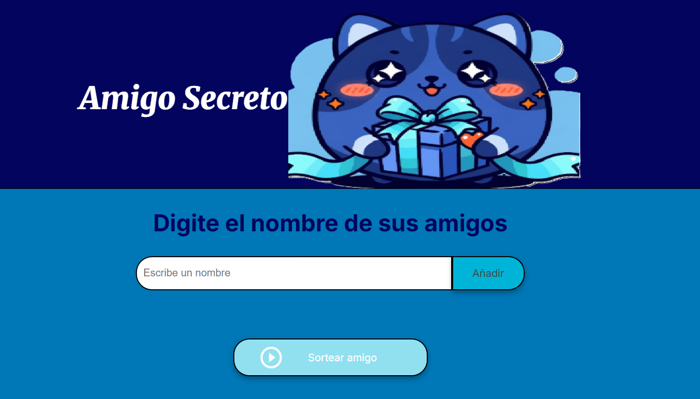

# 🎉 Amigo Secreto 🎉

¡Bienvenido al proyecto **Amigo Secreto**! Esta es una aplicación web divertida y sencilla, diseñada para ayudarte a organizar un intercambio de regalos. Simplemente añade los nombres de todos los participantes y, con el clic de un botón, se sorteará un nombre al azar.

 ---

## ✨ Características

* **Añadir Participantes**: Permite agregar fácilmente los nombres de tus amigos a la lista del sorteo.
* **Ver la Lista de Amigos**: Muestra una lista clara de todas las personas que han sido incluidas en el sorteo.
* **Sorteo Aleatorio**: Con un solo clic, la aplicación selecciona un "Amigo Secreto" de forma completamente aleatoria entre los participantes.
* **Interfaz Intuitiva**: Un diseño limpio y fácil de usar para que cualquiera pueda organizar el sorteo sin complicaciones.
* **Diseño Responsivo**: La aplicación se adapta correctamente a diferentes tamaños de pantalla.

---

## 💻 Tecnologías Utilizadas

Este proyecto fue construido utilizando las tecnologías fundamentales de la web:

* **HTML5**: Para la estructura y el contenido de la página web.
* **CSS3**: Para los estilos, la personalización y la creación de un diseño visualmente atractivo.
* **JavaScript**: Para toda la lógica y la interactividad, como añadir amigos a la lista y realizar el sorteo.

---

## 🕹️ Cómo Jugar
Abre este enlace [Juego del Amigo Secreto](https://paola-marh.github.io/challenge-amigo-secreto/)

1.  Introduce un nombre en el campo de texto que dice **"Escribe un nombre"**.
2.  Haz clic en el botón **"Añadir"** para incluir el nombre en la lista de participantes.
3.  Repite el proceso hasta que todos tus amigos estén en la lista.
4.  Haz clic en el botón **"Sortear amigo"** para seleccionar y mostrar al ganador de forma aleatoria.

¡Que te diviertas con tu intercambio de regalos! 🎁
